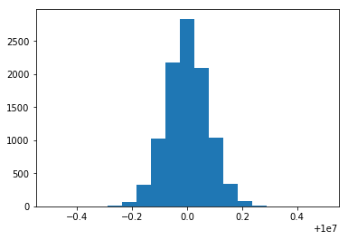

```python
import pandas as pd
import numpy as np
from matplotlib import pyplot as plt
```


```python
counter_error_dist = pd.read_csv('counter_error_distribution.csv')
plt.hist(np.float64(counter_error_dist), bins=np.linspace(10e6-0.5, 10e6+0.5, 20))
plt.show()
```





```python
closed_loop_control_steady_state = pd.read_csv('closed_loop_control_steady_state.csv')
plt.hist(np.float64(closed_loop_control_steady_state['reported_frequency']), bins=np.linspace(10e6-0.5, 10e6+0.5, 20))
plt.show()
```


```python
from numpy.polynomial.polynomial import polyfit
import matplotlib.patheffects as pe

x=np.float64(closed_loop_control_steady_state['ocxo_v_control'])
y=np.float64(closed_loop_control_steady_state['reported_frequency'])

b, m = polyfit(x, y, 1)

plt.hist2d(x, y)
plt.plot(x, b + m * x, path_effects=[pe.Stroke(linewidth=3, foreground='b'), pe.Stroke(linewidth=2, foreground='w')])
plt.show()
```


```python
print(f"{m} Hz/V")
```

    2.5284956695535956 Hz/V


```python
x = closed_loop_control_steady_state.index
y1 = closed_loop_control_steady_state['ocxo_v_control']
y2 = closed_loop_control_steady_state['reported_frequency']
y3 = closed_loop_control_steady_state['filtered_frequency']

fig, ax1 = plt.subplots(figsize=(12,6))

ax2 = ax1.twinx()
ax1.plot(x, y1, '-', color='red')
ax2.plot(x, y2, '.', color='grey', markersize=2, alpha=0.25)
ax2.plot(x, y3, '-', color='black')

ax1.set_xlabel('time, seconds')
ax1.set_ylabel('control voltage', color='r')
ax2.set_ylabel('reported frequency, Hz', color='k')

```


    Text(0, 0.5, 'reported frequency, Hz')


```python

```
